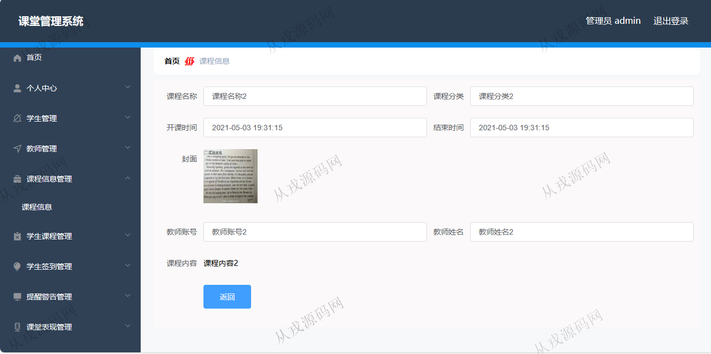
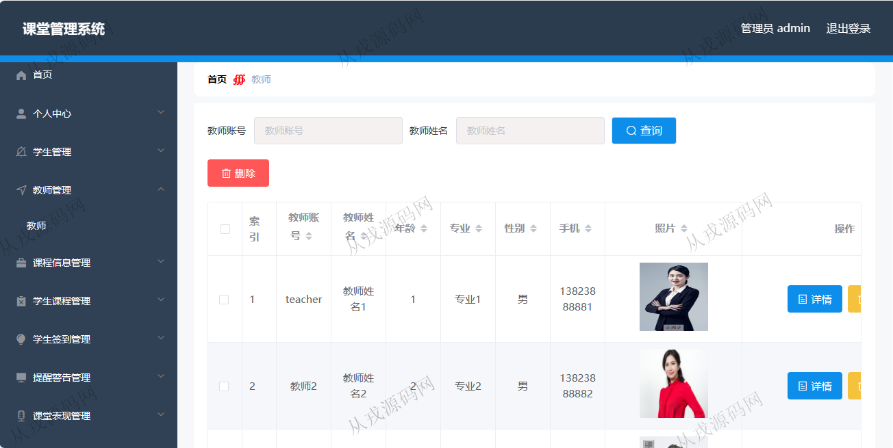
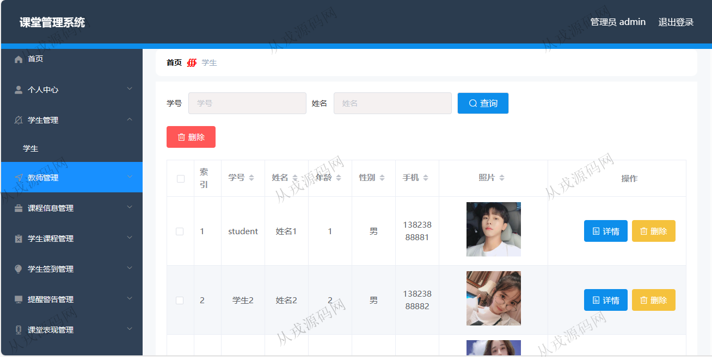
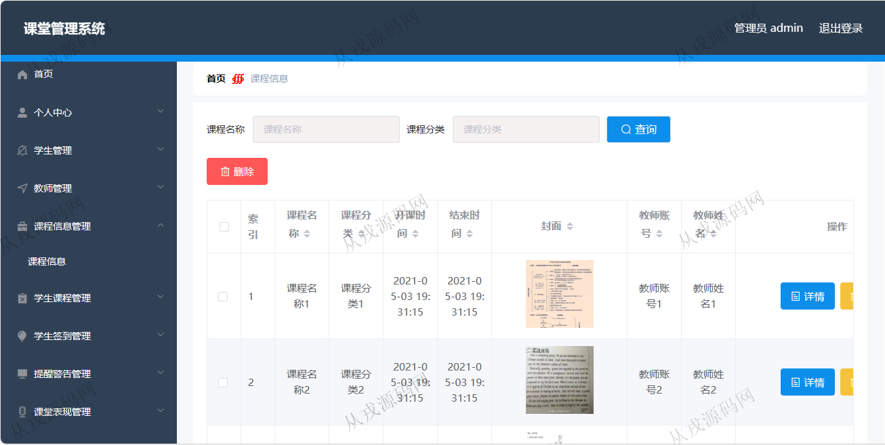
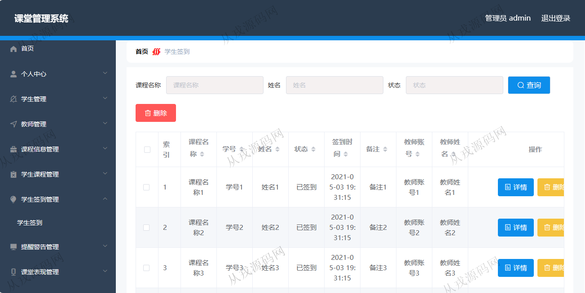
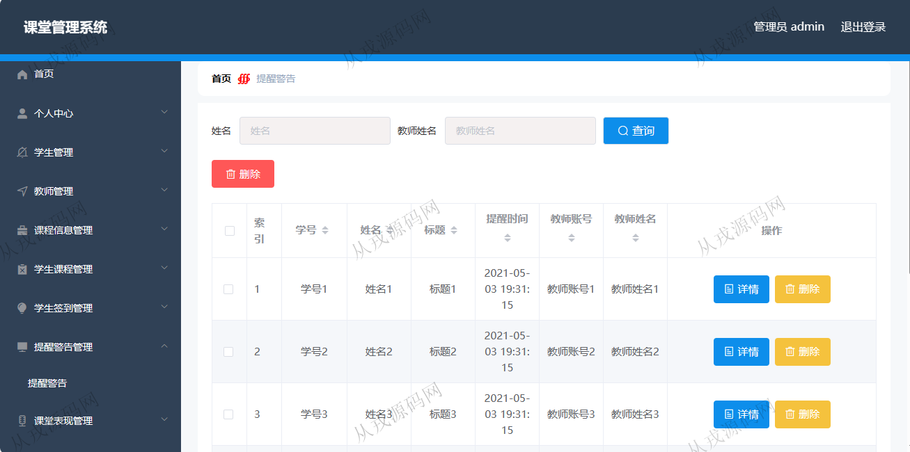
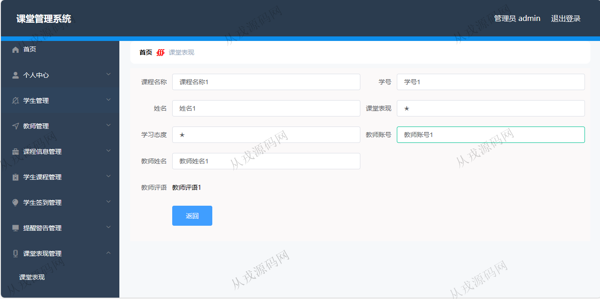
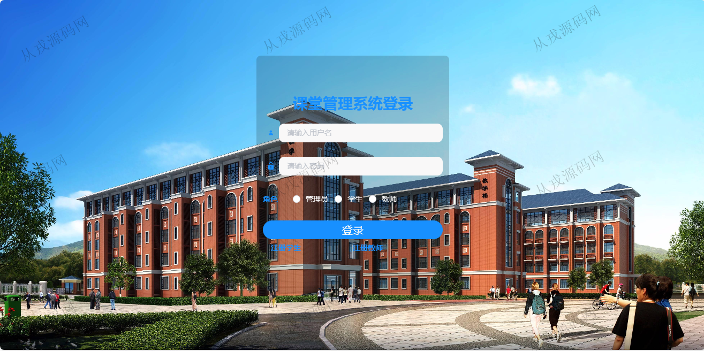

<h1 align="center">136.课堂管理系统</h1>

- <b>完整代码获取地址：从戎源码网 ([https://armycodes.com/](https://armycodes.com/))</b>
- <b>技术探讨、资料分享，请加QQ群：692619798</b> 
- <b>作者微信：19941326836  QQ：952045282</b> 
- <b>承接计算机毕业设计、Java毕业设计、Python毕业设计、深度学习、机器学习</b>
- <b>选题+开题报告+任务书+程序定制+安装调试+论文+答辩ppt 一条龙服务</b>
- <b>所有选题地址 ([https://github.com/YuLin-Coder/AllProjectCatalog](https://github.com/YuLin-Coder/AllProjectCatalog)) </b>

## 项目介绍
基于springboot+vue的课堂管理系统：前端 vue、elementui，后端 maven、springmvc、spring、mybatis；角色分为管理员、教师、学生；集成课程信息管理、学生签到、提醒警告等功能于一体的系统。

## 功能介绍

- 基本功能：学生注册，老师注册，登录、退出
- 个人中心：修改密码，个人信息查看与修改
- 学生管理：学生注册信息进行查询，删除，照片上传
- 教师管理：教师注册信息进行查询，删除，照片上传
- 课程信息管理：课程信息的增删改查
- 学生签到信息：学生签到信息列表查询，关键词搜索
- 提醒警告管理：老师提醒学生信息列表查询
- 课堂表现管理：老师记录学生课堂表现情况
- 布置作业管理：教师给学生布置作业，作业信息的增删改查
- 作业提交：学生角色可以进行作业提交操作，老师查看作业

## 环境

- <b>IntelliJ IDEA 2021.3</b>

- <b>Mysql 5.7.26</b>

- <b>node 14.14.0</b>

- <b>JDK 1.8</b>

## 运行截图

